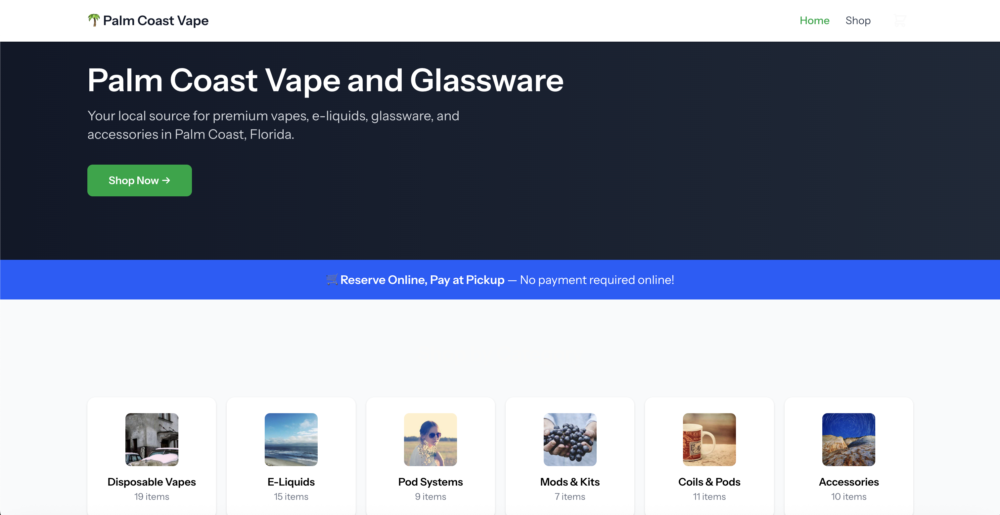
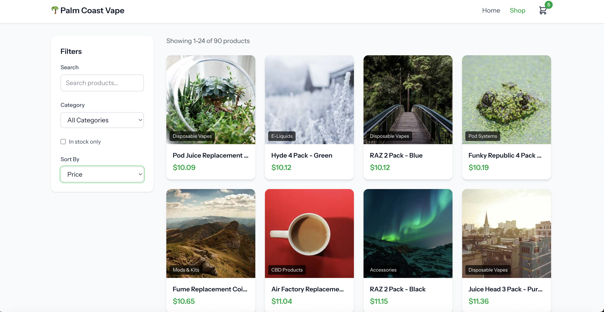
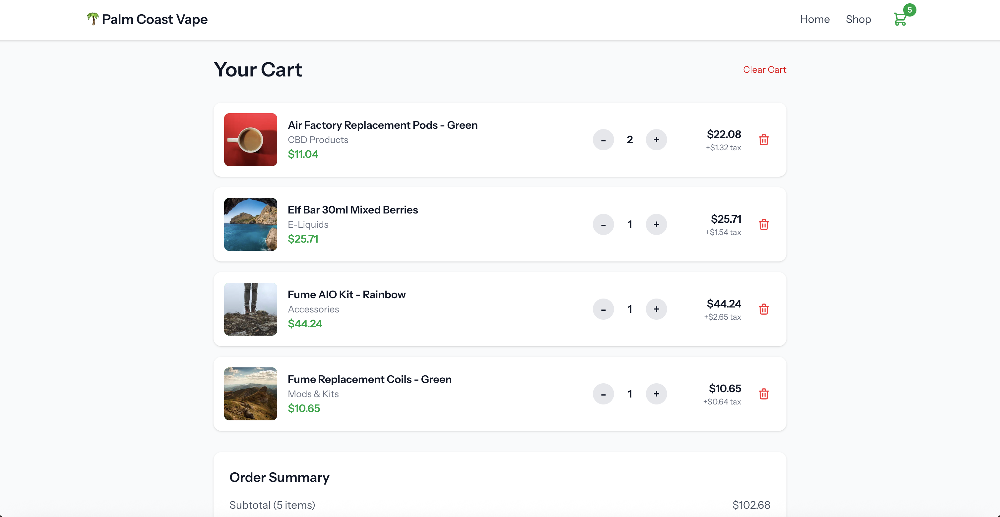
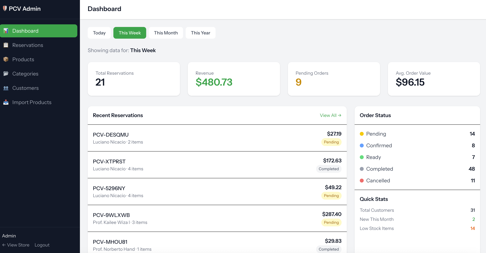

# Palm Coast Vape & Glassware

E-commerce reservation system for a local vape shop. Customers browse products, build a cart, and submit reservations for in-store pickup. Built with Laravel 12, Vue 3, and Inertia.js.


---

## What It Does

**For Customers:**
- Age verification gate (required for vape shops)
- Browse products with filters (category, search, in-stock)
- Add to cart, adjust quantities, checkout
- Get email confirmation with pickup details

**For Store Admins:**
- Dashboard with daily stats and low stock alerts
- Manage products and categories (CRUD + image uploads + CSV import)
- Process reservations (pending → ready → completed)
- View customer order history

---

## Screenshots

<details>
<summary>View screenshots</summary>






</details>

---

## Tech Stack

- **Backend:** Laravel 12, PHP 8.4, MySQL
- **Frontend:** Vue 3 (Composition API), Inertia.js, Tailwind CSS
- **Queue/Cache:** Redis
- **Email:** Mailgun
- **Testing:** Pest
- **CI/CD:** GitHub Actions → DigitalOcean

---

## Local Setup

```bash
git clone https://github.com/LucianoNicacio/palm-cost-vape
cd palm-coast-vape

composer install
npm install

cp .env.example .env
php artisan key:generate

# Update .env with your database credentials

php artisan migrate --seed
php artisan storage:link
npm run build
php artisan serve
```

Visit `http://localhost:8000`

**Admin login:** admin@palmcoastvape.com / password123

---

## Project Structure

```
app/
├── Http/Controllers/
│   ├── Admin/              # Dashboard, Products, Categories, Reservations
│   ├── CartController.php
│   ├── CatalogController.php
│   └── CheckoutController.php
├── Models/
│   ├── Product.php         # scopes: active(), inStock(), search()
│   ├── Category.php
│   ├── Reservation.php
│   └── Customer.php
└── Mail/
    └── ReservationConfirmation.php

resources/js/
├── pages/
│   ├── Home.vue
│   ├── Catalog/Index.vue
│   ├── Cart/Index.vue
│   └── Admin/...
├── components/
│   ├── ProductCard.vue
│   ├── ProductModal.vue
│   └── CategoriesGrid.vue
└── layouts/
    ├── MainLayout.vue
    └── AdminLayout.vue
```

---

## Some Things Worth Noting

**Age Verification** - Middleware checks session before allowing access to shop routes. Verification is logged to database for compliance.

**Cart** - Session-based. Validates stock on every action so customers can't checkout more than available.

**Checkout** - Wrapped in a database transaction. Creates customer (or finds existing by email), creates reservation, decrements stock, queues confirmation email. If anything fails, everything rolls back.

**Product Queries** - Using Eloquent scopes to keep controllers clean:
```php
Product::active()->inStock()->search($term)->paginate(24)
```

**Emails** - Queued through Redis so checkout doesn't wait for email to send. Supervisor keeps the queue worker running.

---

## Running Tests

```bash
php artisan test

# or specific file
php artisan test --filter=AgeVerificationTest
```

---

## Deployment

GitHub Actions runs tests on push to main. If they pass, it SSHs into the DigitalOcean droplet and runs the deploy script (pull, composer install, migrate, build assets, restart queue).

---

## Author

**Luciano** - Laravel Developer

I built this as a real project for a local vape shop, and also as a portfolio piece to demonstrate Laravel + Vue + Inertia development. Previously worked at OHO Interactive building sites for Yale, Harvard, and University of Pittsburgh.

[LinkedIn](https://linkedin.com/in/luciano-nicácio) · [GitHub](https://github.com/LucianoNicacio)
